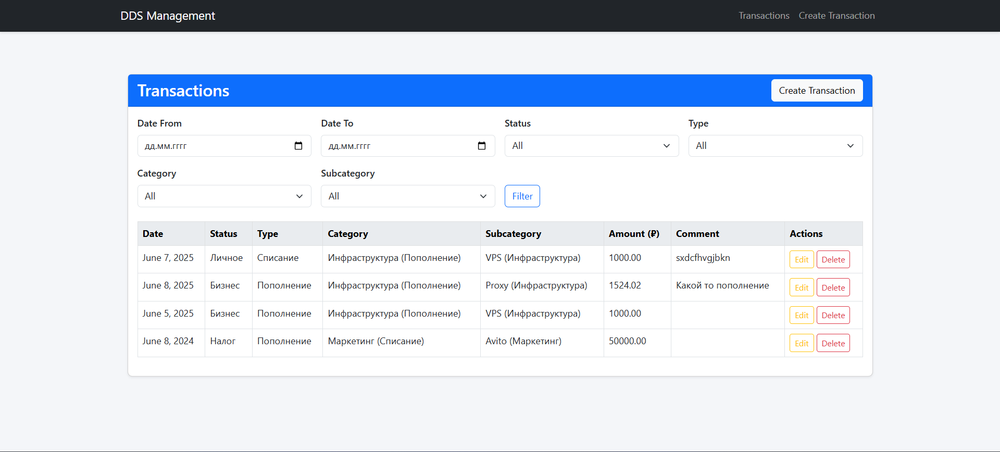
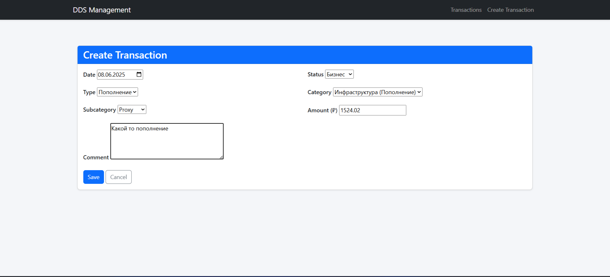
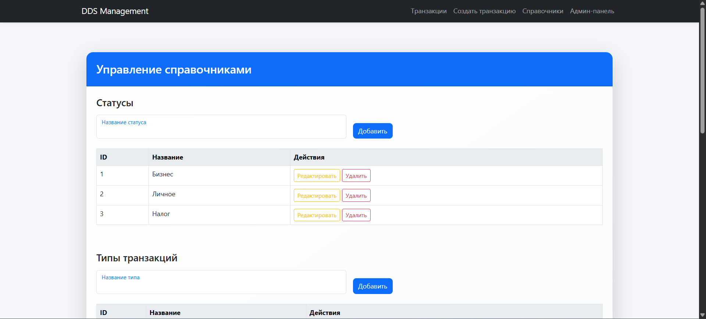
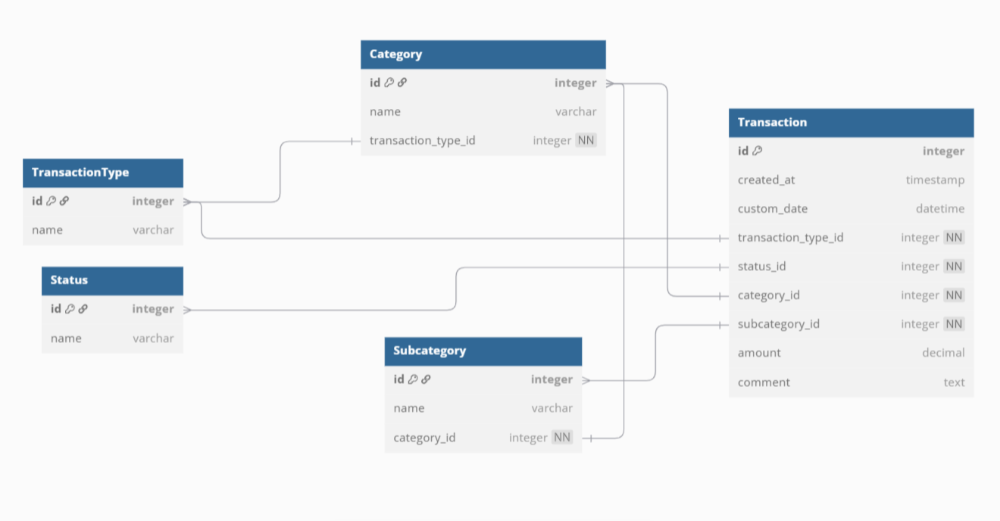

# Веб-приложение для управления ДДС

Это веб-приложение на основе Django для управления движением денежных средств (ДДС), разработанное в соответствии с предоставленным тестовым заданием.

## Инструкция по установке

### Требования

- Python 3.8 или выше
- pip
- Git
- SQLite (включен в Python)

### Установка

1. Клонируйте репозиторий:
   ```bash
   git clone https://github.com/Erezhep/dds-tracker.git
   cd dds-tracker
   ```

2. Создайте и активируйте виртуальное окружение:
   ```bash
   python -m venv venv
   source venv/bin/activate  # На Windows: venv\Scripts\activate
   ```

3. Установите зависимости:
   ```bash
   pip install -r requirements.txt
   ```

4. Примените миграции:
   ```bash
   python manage.py makemigrations
   python manage.py migrate
   ```

5. Создайте суперпользователя для доступа к админ-панели:
   ```bash
   python manage.py createsuperuser
   ```
   Следуйте инструкциям в терминале, чтобы задать имя пользователя, email (можно оставить пустым) и пароль.

6. Запустите сервер разработки:
   ```bash
   python manage.py runserver  # По умолчанию используется порт 8000
   ```
   Для использования другого порта, например 1234, выполните:
   ```bash
   python manage.py runserver 1234
   ```

7. Перейдите по адресу `http://localhost:8000/` для доступа к приложению.

## Проверка админ-панели

Для проверки корректности работы приложения и наличия данных:
1. Перейдите по адресу `http://localhost:8000/admin/` (или другой порт, если указан).
2. Войдите, используя учетные данные суперпользователя, созданные на шаге 5.
3. В админ-панели проверьте:
   - Наличие моделей: `Status`, `TransactionType`, `Category`, `Subcategory`, `Transaction`.
   - Возможность добавления, редактирования и удаления записей для статусов, типов, категорий и подкатегорий.
   - Просмотр списка транзакций и их фильтрацию.
  
## Управление справочниками

Для управления справочниками (статусы, типы, категории, подкатегории):
1. Перейдите по адресу `http://localhost:8000/reference/` (или другой порт, если указан).
2. Используйте формы для добавления новых записей.
3. Редактируйте или удаляйте существующие записи через соответствующие кнопки в таблицах.

## Структура проекта

- **dds/models.py**: Определяет модели данных (`Status`, `TransactionType`, `Category`, `Subcategory`, `Transaction`).
- **dds/views.py**: Содержит представления для операций CRUD и фильтрации.
- **dds/urls.py**: Конфигурация URL-адресов.
- **dds/forms.py**: Форма для создания и редактирования транзакций.
- **templates/**: HTML-шаблоны для фронтенда с встроенными стилями и JavaScript.

## Функциональность

- **Управление транзакциями**: Создание, просмотр, редактирование и удаление записей о транзакциях с полями: дата, статус, тип, категория, подкатегория, сумма и комментарий.
- **Фильтрация**: Фильтрация транзакций по диапазону дат, статусу, типу, категории и подкатегории.
- **Динамическая форма**: Выбор категории автоматически обновляет доступные подкатегории с помощью встроенного JavaScript.
- **Управление справочниками**: Добавление, редактирование и удаление статусов, типов, категорий и подкатегорий с учетом зависимостей (категории привязаны к типам, подкатегории — к категориям).
- **Отзывчивый интерфейс**: Построен на Bootstrap 5.3 для современного и адаптивного дизайна, с минимальными встроенными стилями CSS.
- **Валидация**: Валидация на стороне клиента и сервера для обязательных полей.

## Примечания

- Для упрощения используется база данных SQLite, как разрешено в задании.
- Фронтенд реализован с использованием Bootstrap 5.3, с встроенными CSS и JavaScript в шаблонах, без внешних статических файлов.
- Админ-панель (`/admin/`) и страница справочников (`/reference/`) доступны для управления статусами, типами, категориями и подкатегориями.
- Дизайн вдохновлен современными шаблонами дашбордов, с акцентом на интуитивность и удобство.
- 
## 🖼 Скриншоты

Ниже представлены скриншоты интерфейса приложения, демонстрирующие ключевые функции:

- **Список транзакций**: Главная страница с таблицей транзакций и фильтрами.  
  

- **Форма создания/редактирования**: Форма для добавления или изменения транзакции с динамическим выбором подкатегорий.  
  

- **Управление справочниками**: Страница для управления статусами, типами, категориями и подкатегориями.  
  

- **Структура база данных**: ER диаграмма  
  